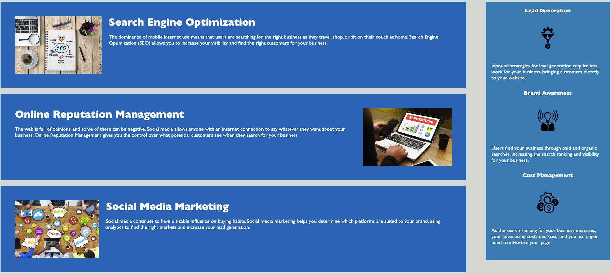

# Horiseon: Social Solution Services.

## <Strong>Description<Strong>:

* Horiseon works for you and helps with your business needs with the use of S.E. Optimization, O.R. Marketing and S.M. Marketing.  This can include with numerous Lead Generation, Brand Awareness and Cost Management.

## <Strong>Installation<Strong>:
* On a web browser please follow the link to begin exploring. [Horiseon.](https://junel-balbin.github.io/BC1-Refactor-Horiseon/)

## <Strong>Usage<Strong>:
* To use this website, hover your mouse over Navigation Header on the upper right.  And select any of the three options you are currently interested in learning for more information.

* Clicking on them will direct you to the following information.

## <Strong>Contributing<Strong>:
* Feel free to add to your liking.  Reach out to me for details.  Remember to clean up after yourself.

## <Strong>Credits<Strong>:
* Starter Codes provided by EdX and UCB.

* [W3Schools.com](https://www.w3schools.com/cssref/sel_hover.php) -  Hover feature.

* The Git Guild - README resource: Link below.
[Youtube Resource for README.](https://www.youtube.com/watch?v=a8CwpGARAsQ)

* Banner Maker for README.
[Banner Maker Link.](https://banner.godori.dev/)

## <Strong>License<Strong>:
* MIT License.
